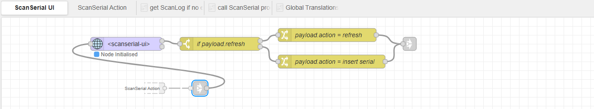
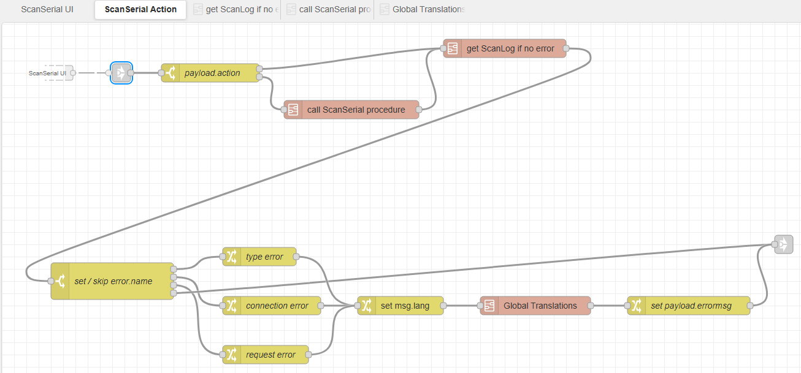
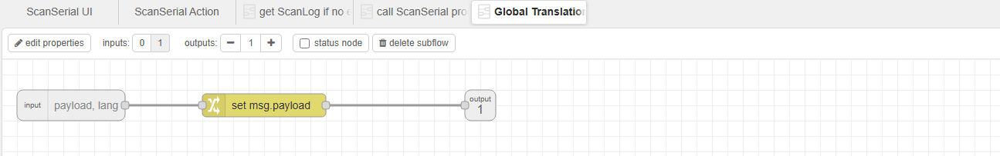
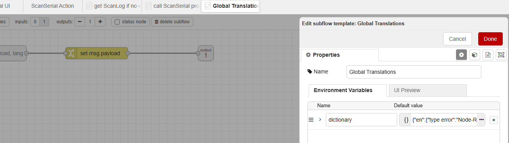
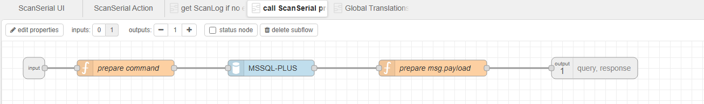
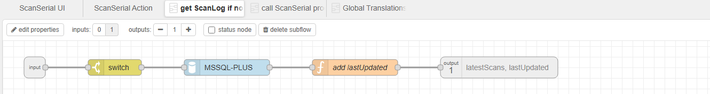

# Manufacturing Execution System (MES) Sandbox

This project provides a containerized development environment that allows to simulate manufacturing workflows such as traceability, event logging and validation. It uses Docker to run Node-RED and SQL Server.

## Tech stack
- Node-RED (workflow automation)
- Microsoft SQL Server (T-SQL, transactions, stored procedures)
- Docker (containerized services)
- SQL Server Data Tools (.sqlproj)
- JavaScript (Node-RED function nodes)

## Preview of "scanserial-ui.json" flow in Node-RED
ScanSerial flows are connected across tabs using Link nodes located at the beginning and the end of each flow.

- "ScanSerial UI" flow


- "ScanSerial Action" flow


- "Global Translations" subflow


- "Global Translations" subflow properties


- "call ScanSerial procedure" subflow


- "get Scanlog if no error" subflow


## General setup (using VS Code)

### Prepare Dockerfile for "node_modules" folder import (Optional)

1. Open `.devcontainer/node-red/Dockerfile` file.
2. Read comments in the file for further steps.

### Run services

1. Open `.devcontainer/docker-compose.yml`.
2. Click "Run all Services" button (located above the first text line).

### Connect VS Code to SQL Server

1. Click "SQL Server" icon located on Activity Bar (left sidebar). A panel will open.
2. Hover over "localhost" connection.
3. Select "Edit Connection..." (the pencil icon). A tab will open.
4. Fill the password field (`YourStrong!Password123`).
5. Click "Connect" to save changes.

### Publish Database Project

1. Click "Database Projects" icon located on Activity Bar (left sidebar). A panel will open.
2. Right click on the project "master" and select "Publish". A tab will open.
> [!TIP]
> You can also use "Schema Compare" option instead of "Publish" to apply changes to the database.
3. Select server.
4. Click "Publish" button.
> [!NOTE]
> A panel will open after a moment. In the panel's "Background Tasks" section a "Deploy dacpac" task will start. The database will be ready after the task finishes.

### Connect Node-RED to SQL Server

1. Open "Ports" tab from bottom panel.
2. Hover over the link of Port 1880 and click "Open in Browser" button. It will open Node-RED.
3. From hamburger menu (in upper right corner), select "Import".
4. Select "Local" tab.
5. Select `setup.json` file.
6. Click "Import" button.
> [!IMPORTANT]
> A popup may appear when importing another project. On the popup, click "Import copy" button to proceed.
7. From "info" tab (in right sidebar) open `Global Configuration Nodes / MSSQL-CN` and double click on `MSSQL-CN` item. A panel will open.
8. In "Properties" tab, fill the username field (`sa`) and the password field (`YourStrong!Password123`).
9. Click "Update" to save changes.
10. Right click on "Setup" tab and select "Delete".
11. You can now import other projects, click "Deploy" (in upper right corner) and check functionalities.
> [!IMPORTANT]
> Imported "uibuilder" nodes have `<no url>` value. Replace them with URL matching imported project name (e.g. for "scanserial-ui.json" project, set URL: `scanserial-ui`). Refer to a specific project structure in folders: "node-red-uibuilder" and "node-red-library".

## Usage

### Node-RED

After completing General setup you can watch "Creating a flow - Node-RED Essentials" by Node-RED (2-minute YouTube video) or check their official documentation.

## Additional setup

### Connection string

```
Server=db,1433;Database=master;User Id=sa;Password=YourStrong!Password123;TrustServerCertificate=True;
```

> [!IMPORTANT]
> Replace `db` with `localhost` when connecting from VS Code extensions.

### Node-RED

Edit `MSSQL` node connection properties:

- Server: `db`
- Username: `sa`
- Password: `YourStrong!Password123`
- Domain: (leave empty)
- Database: `master`
- Use Encryption?: (checked)
- Trust Certificate?: (checked)

### CloudBeaver

1. From `.devcontainer/docker-compose.yml`, uncomment "cloudbeaver" service and "cloudbeaver_data" volume.
2. From `.devcontainer/devcontainer.json` uncomment port "8978".
3. Run the service and access it in browser.
4. When setting up, make sure to select "Trust Server Certificate".

## Importing new Node-RED projects

To import new projects (by recreating Node-RED container):

1. Remove `node-red` container.
2. Remove `node_red_data` volume.
3. Rebuild the container by using the `docker-compose-build.sh`.

## Restore Node-RED from backup

1. Backup using `docker-volume-node-red-create.sh` (creates `node_red_data_volume.tgz`).
2. Remove `node-red` container.
3. Remove `node_red_data` volume.
4. Restore using `docker-volume-node-red-import.sh`.